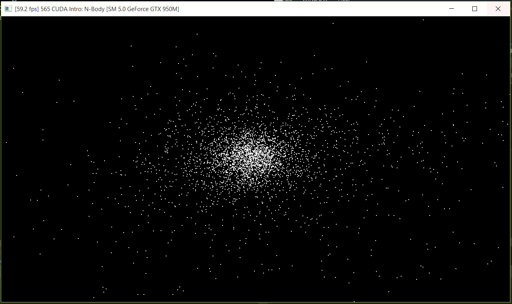
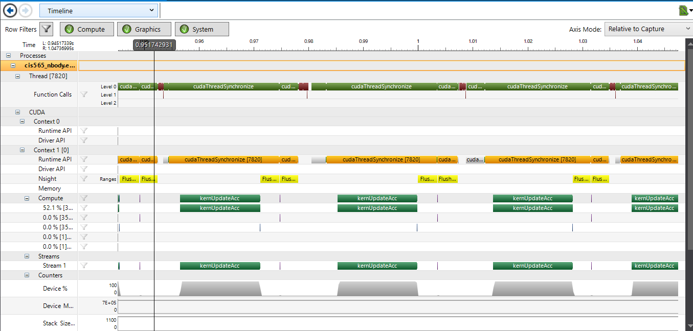
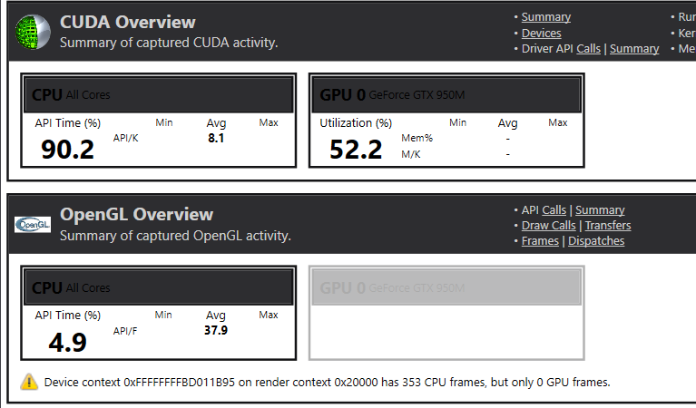
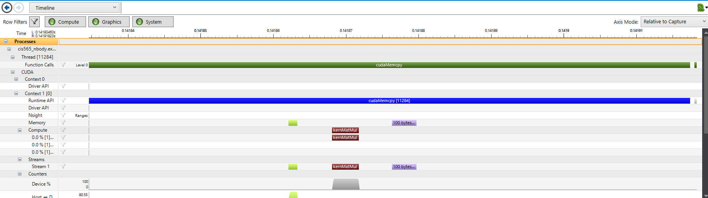

CUDA Introduction
=================

**University of Pennsylvania, CIS 565: GPU Programming and Architecture, Project 1**

* Ziwei Zong
* Tested on: Windows 10, i7-5500 @ 2.40GHz 8GB, GTX 950M (Personal)

Part 1 - N-body Simulation
--------------------------

#### Screenshots : 
N = 5000

#### Analysis :
(1) Number of Planets

    N=10000 : 16 fps
			kernUpdateAcc 52ms
	        kernUpdateVelPos 0.021ms
    N=5000 : 50fps
			kernUpdateAcc 14ms
	        kernUpdateVelPos 0.014ms
    N=1000 : 60fps
			kernUpdateAcc 1.45ms
	        kernUpdateVelPos 0.01ms

As the number of planets goes up, the time increment for kernel updating velocity and position is very small.But the kernal updating acceleration affected by the number of planet significantly. 
On one hand, the computation in kernUpdateAcc is more complicated than that in kernUpdateVelPos. On the other hand and more importantly, the computation in kernUpdateAcc is reletive to (almost linear to) the number of planets.

Below is a test when no matter how many total bodies are, when calculating attractions by other bodies, instead of counting all N bodies, only calculate 1000 of them.
	
	N=10000 : 60 fps (N/10 = 1000 other bodies' attraction calculated)
			kernUpdateAcc 5.8ms
			kernUpdateVelPos 0.022ms
	N=5000  : 60 fps (N/5 = 1000 other bodies' attraction calculated)
			kernUpdateAcc 2.9 ms
			kernUpdateVelPos 0.015ms
	N=1000  : 60 fps (N/1 = 1000 other bodies' attraction calculated)
			kernUpdateAcc 1.45 ms
			kernUpdateVelPos 0.01ms

This result shows that the N-body attraction force calculation takes the most amount of computation time, thus, approximate the attractions of other bodies by calculationg only a portion of N-boies can be a start to accelerate the programm.

(2) Tile and block sizes
    N = 10000, BlockSize = 32,    GridSize = 313, kernUpdateAcc 51.9ms ,  16.6fps 
    N = 10000, BlockSize = 64,    GridSize = 157, kernUpdateAcc 51.09ms,  16.7fps
    N = 10000, BlockSize = 128,   GridSize = 79,  kernUpdateAcc 51.12ms,  16.6fps
    N = 10000, BlockSize = 256,   GridSize = 40,  kernUpdateAcc 51.3ms ,  16.7fps
    N = 10000, BlockSize = 512,   GridSize = 20,  kernUpdateAcc 51.6ms ,  16.6fps
    N = 10000, BlockSize = 1024,  GridSize = 10,  kernUpdateAcc 51.6ms ,  16.6fps

N = 5000, BlockSize = 128, GridSize = 40

#### Other :
	CMakeList modification: removed "list(APPEND CUDA_NVCC_FLAGS -G -g)"

 Part 2 - Matrix Math
--------------------------
(1) Tile and block sizes
Changing the block size and grid size leads to modification for the calculating code for multiplication. But there's no need to change add and sub codes.
    When BlockSize = 25, GridSize = 1, MatC[tx*5+ty] += matA[tx*width + i] * matB[i*width + ty];
    When BlockSize = 5,  GridSize = 5, MatC[(blockIdx.x * blockDim.x) + threadIdx.x] += matA[bx*width + i] * matB[i*width + tx];

(2) Expected performance comparison with CPU

Compared to the time spent on CudaMelloc and CudaMemcpy, the time spent on kernel computation is relatively very short. Thus, when the size of the matrix is small, the advantages of using GPU is not very obvious.