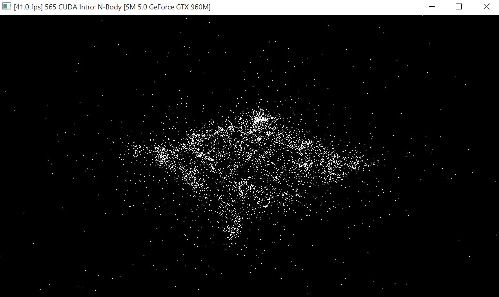
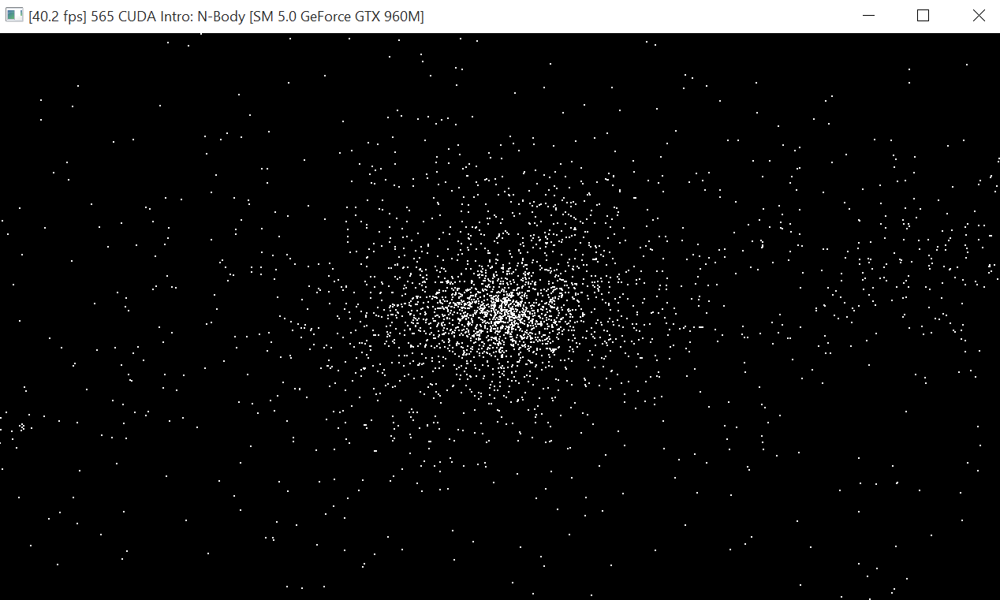
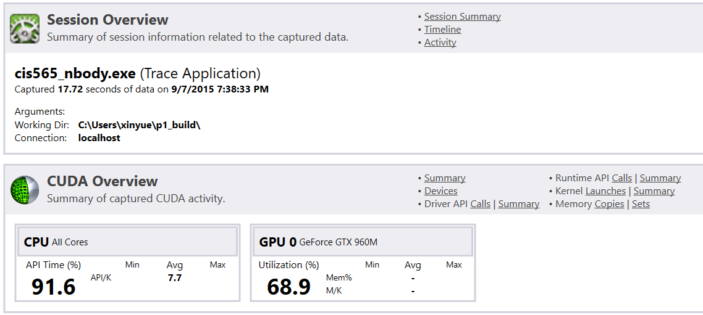
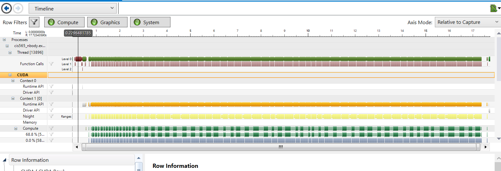
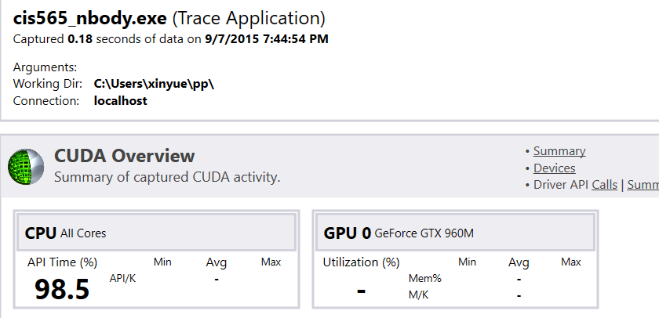
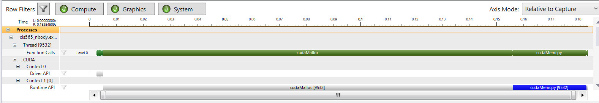
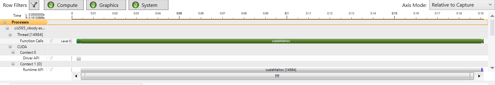

CUDA Introduction
=================

**University of Pennsylvania, CIS 565: GPU Programming and Architecture, Project 1**

*  Xinyue Zhu
* Tested on:  Windows 10, i5-5200U @ 2.20GHz 8GB, GTX 960M  

### MY README

Include screenshots, analysis, etc. 

###Part1:
*1)change the number of planets N：
 N=7000 20fps
 
 N=5000 40fps
 
 N=2000 60fps
 
 while N=2000:
 .png)
 .png)
 while N=5000:
  
  
 while N=7000:
  .png)
  .png)
  From above we can see, when N goes up, usage of GPU goes up,fps goes down,running time goes up.
  Because when the number of planets increase the calculation of gravity increase.
*2)change the block size:
while N=7000, block size=56,128,256,gridsize=126,56,28:their fps are all around 20.
and no much difference in the time.
*3)at project2,because the size of the mat is too small block size do not affect much of the timeline and GPU
block size=1
	

block size=1000

###Part 2: 
 If the large amount of data is simple and do not have much relevance with each other, the GPU will perform better.
 CPU has cache, it can store and use different kind of data to calculate.

