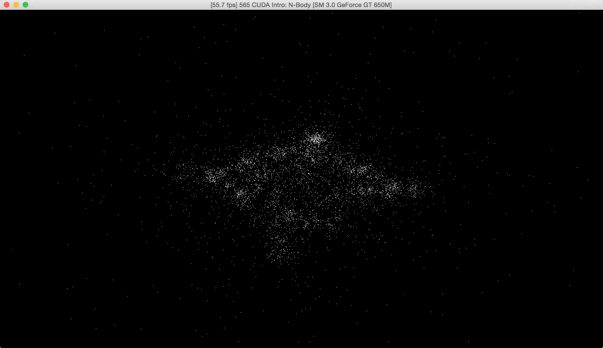

CUDA Introduction
=================

**University of Pennsylvania, CIS 565: GPU Programming and Architecture, Project 1**

* Ratchpak (Dome) Pongmongkol
* Tested on: OSX Yosemite 10.10.5, i7 @ 2.4GHz 16GB, GT 650M 1024MB (rMBP Early 2013)

#  N-body Simulation: Screenshot 

## Performance Analysis

## Parts 1 & 2: How does changing the tile and block sizes affect performance? Why?
### Part 1:
N = 10000

block size				 	  32		 64		   96	    128		  256
tile size					 313		157		   79	     40		   20
fps 	   		   			 7.5       14.0      17.4      19.7      20.4
kernUpdateAcc(ms) 		128.9740    69.0305   55.1899   47.2931   47.1370
kernUpdateVelPos(ms) 	  0.0356 	 0.0303    0.0290    0.0297    0.0298

** This benchmark is assumes that tile size = ceil(N / block size)
	- If N is large enough, changing block size will also change tile size
** The result is roughly the same between block size = 128 to block size = 1024

My assumption : When the block size is small, the tile size increases. One reason I could think of is that the number of concurrent block is limited (resulting in some block having to wait in the queue). This 'delay' disappears when the tile size decreases to the point that or all threads can run concurrently, so the performance after block size = 128 remains the same. It is also possible that this might be caused by block-switching overhead.

### part 2: 

block size				 	  32		 64		   96	    128		  256		512		 1024
ms						  0.7245 	 0.6811    0.7230    0.8163    0.8007    0.7196    0.8156

** averaged from 100 times of execution

My assumption: Since the number of threads per block must be a multiple of 32 (which is already larger than dim*dim, or number of concurrent threads). Also, changing the block size will still result as having tile size = 1. This means changing the block size shouldn't affect its performance.

## Part 1: How does changing the number of planets affect performance? Why?
Block size 256
N							1000	   2500      5000      7500      10000
fps 	   		   			60.0	   60.0		 57.3      32.7       20.4
kernUpdateAcc(ms) 		  4.2679	 6.2785	  13.9847   27.0813    47.1370
kernUpdateVelPos(ms) 	  0.0208	 0.0199	   0.0196    0.0249     0.0298   

If we plot graphs with kernUpdateAcc and kernUpdateVelPos, it will show that the first one is increasing exponentially as N grows, while the latter is growing linearly. This makes perfect sense since gravity calculation is O(N^2) and velocity/postion updating is O(N) 

## Part 2: Without running comparisons of CPU code vs. GPU code, how would you expect the performance to compare? Why? What might be the trade-offs?
For such a small input like 5x5 matrices, I would say the performance should be roughly the same. 

The difference is that  
	GPU running time = cudaMemcpy + kernel func time (for each element in mat C)
	CPU running time = dim * dim * time spent on each element in mat C

So if the matrix dimension is low enough that the time spent on cudaMemcpy is longer (which might be the case for mul_add and mul_sub), CPU would win this performance contest. Otherwise, GPU will be slightly faster.
