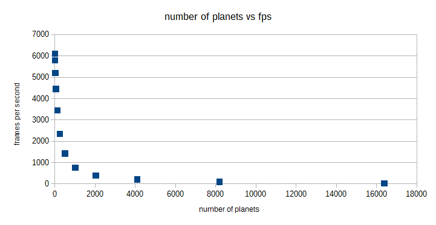

CUDA Introduction
=================

**University of Pennsylvania, CIS 565: GPU Programming and Architecture, Project 1**

* Kangning Li
* Tested on: Windows 10, i7-4790 @ 3.6GHz 16GB, GTX 970 4096MB (Personal)

This repository contains HW1 for CIS 565 2015, a CUDA nbody simulation and a basic 5x5 matrix adder, subtractor, and multiplier implemented as an introduction to CUDA.

## Questions

### Parts 1 & 2: How does changing the tile and block sizes affect performance? Why?

|Block Size | FPS |
|-----------|-----|
|8 | 51.9 |
|16 | 123.3 |
|32 | 168 |
|64 | 169.1 |
|128 | 169 |
|256 | 166 |
|512 | 165 |
|1024 | 101 |
|2048 | N/A, crash |

For Part 1, increasing the block size improves performance (measured as fps with visualization deactivated) up to a point, after which performance decreases. My guess is that increasing the number of threads only improves performance until all the GPU's cores are saturated in each timestep, after which adding threads causes only a performance hit from the additional overhead of launching threads and the GPU trying to maintain the illusion that it has the number of resources requested.

For Part 2, increasing the block size beyond the matrix dimensions does not improve performance as this gives the program more threads than it has data for. 

### Part 1: How does changing the number of planets affect performance? Why?

|Planets | FPS |
|-----------|-----|
|8 | 6100 |
|16 | 5800 |
|32 | 5200 |
|64 | 4450 |
|128 | 3450 |
|256 | 2350 |
|512 | 1420 |
|1024 | 760 |
|2048 | 400 |
|4096 | 207 |
|8192 | 95 |
|16384 | 25.3 |

Increasing the number of planets causes an overall exponential performance hit. This would be expected in a single core system as the planet influence detection is naive, that is, O(n^2) where n is the number of planets.However, the performance hit does not seem to have been exponential for smaller numbers of planets. This is likely because the GPU still has the resources to compute all the influences in parallel. Thus, the performance hit should be approximately linear until the GPU's cores are saturated.

### Part 2: Without running comparisons of CPU code vs. GPU code, how would you expect the performance to compare? Why? What might be the trade-offs?

The GPU code should perform significantly faster for very large matrices. A n*n matrix will require n*n adds to compute matrix addition, requiring n^2 serial computations on a single core. In parallel this becomes n*n / (number of cores available, capped at n*n). However, the performance difference for small matrices may be similar or worse depending on the overhead of transferring the matrices from host to device memory and launching threads.