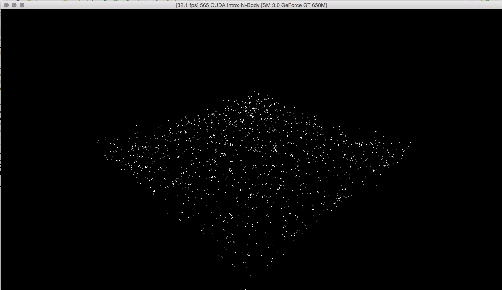
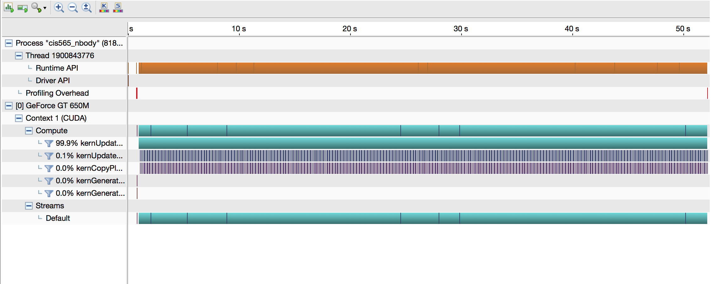
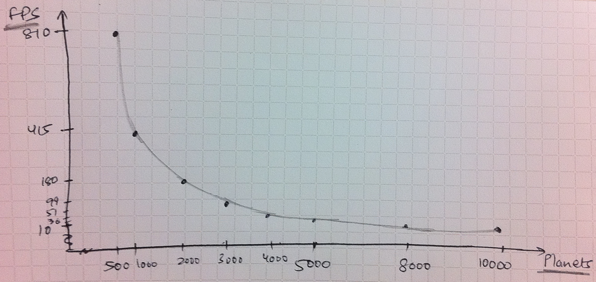

CUDA Introduction
=================

**University of Pennsylvania, CIS 565: GPU Programming and Architecture, Project 1**

* SANCHIT GARG
* Tested on: Mac OSX 10.10.4, i7 @ 2.4 GHz, GT 650M 1GB (Personal Computer)

### SANCHIT GARG: ReadMe

## Part 1: N-body Simulation

In this part, I was supposed to work on the framework build by Kai and complete a few function for the amazing N-Body simulation. I wrote the code to find the accelaration of all the planets and then update their position using forward euler integration. Next, we call the CUDA kernels to update the position of all the particles in parallel.

## ScreenShots

## Part 2: Matrix Math

In this part, I wrote a simple CUDA program to do matrix addition, subtraction and multiplication. Add these calculations were done on the GPU.

## Part 3: Performance Analysis

### Questions

* Parts 1 & 2: How does changing the tile and block sizes affect performance? Why?
	Part 1 :
		Number of planets = 4096
		
		--------------------------------------
		| TILE SIZE | BLOCK SIZE | 	  FPS	 |
		|     1		|	 4096	 |	 ~1950	 |
		|     4		|	 1024	 |	   51 	 |
		|    32  	|	  128 	 |	   49	 |
		|    64		|	  64 	 |	   47 	 |
		|   128 	|	  32 	 |	   27	 |
		|   1024	|	  4 	 |	   3	 |
		|   4096	|	  1 	 |	   1	 |				
		--------------------------------------
		

	The first value does not make sense. Maximum possible threads per block is 1024, when I made the block size to be 4096, it gave me a weird result.

	Other than that, we see that reducing the block size and increasing the tile size makes the simulation slower. This might mean that creating blocks is more expensive than creating threads. Hence we must create more threads per block that creating more blocks.

	Part 2 :
		Changing the tile and block sizes did not affect the simulation time a lot here. the results are as follows
		
		--------------------------------------
		| TILE SIZE | BLOCK SIZE | Time (ms) |
		|     1		|	  25	 |	 0.053	 |
		|     2		|	  13	 |	 0.049	 |
		|     5		|	  5 	 |	 0.050	 |
		|    10		|	  3 	 |	 0.051	 |
		|    25		|	  1 	 |	 0.050	 |				
		--------------------------------------
		

	The calculations are not significant enough to effect the performance much. Hence changing the block or thread size does not change running time.

* Part 1: How does changing the number of planets affect performance? Why?
	Reducing the number of planets speeds up the simulation. The number of planets and the respective FPS is as follows :
	1. 10000 Planets : 10 FPS
	2. 8000 Planets : 15 FPS
	3. 5000 Planets : 36 FPS
	4. 4000 Planets : 51 FPS
	5. 3000 Planets : 99 FPS
	6. 2000 Planets : 180 FPS
	7. 1000 Planets : 415 FPS
	8. 500 Planets : 810 FPS
	
	
		
	We see that the simulation speed up is drastic after about 4000 planets. This might be because of the number of threads. The maximum number of threads is constant. When we reach about 4000, it is possible that the accelaration calculation for every planet is done on one thread. Hence the calculations become extremely fast. As we decrease the number further, the number of serial calculation for accelaration decrease. Hence making the simulation faster.
	
	
* Part 2: Without running comparisons of CPU code vs. GPU code, how would you expect the performance to compare? Why? What might be the trade-offs?
  	The performance of the CPU should be better in this case. We know that the GPU is good in floating point calculations but is slow in memory access. In the case of multiplication, there is a lot of memory access. Hence the GPU implementation might be slower. 
  	If the matrices where of very large dimensions, then the faster numerical calculation should overshadow the slow access and the GPU implementation should be faster. The tradeoff should be the time to access memory versus the number of numerical calculations.
