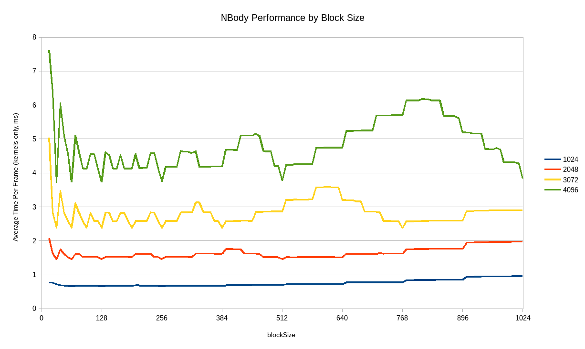

# CUDA Introduction

**University of Pennsylvania, CIS 565: GPU Programming and Architecture, Project 1**

Terry Sun; Arch Linux, Intel i5-4670, GTX 750

## Part 1: A Basic Nbody Simulation

(2500 planets, 0.5s per step)

### Performance

The graph shows time taken (in ms) to update one frame at block sizes from 16
to 1024 in steps of 8, for various values of N (planets in the system).

I measured performance by disabling visualization and using `CudaEvent`s to time
the kernel invocations (measuring the time elapsed for both `kernUpdateVelPos`
and `kernUpdateAcc`). The recorded value is an average over 100 frames.

Code for performance measuring can be found on the `performance` branch.

Changing the number of planets, as expected, increases the time elapsed for the
kernels, due to a for-loop in the acceleration calculation (which increases the
time with the number of total planets in the system). More interestingly, it
also changes the way that performance reacts to block size (see n=4096 in the
above plot). The difference in performance as block size changes is much greater
with greater N, and also exhibits different behaviors.

At certain block sizes, the time per frame sharply decreases, such as at N=4096,
block size=1024, 512, 256, 128. These are points where each block would be
saturated (ie. no threads are started that are not needed).

I have no idea what's going on with the spikes peaking at N=4096, block size~800
or N=3072, block size~600.

# Part2: An Even More Basic Matrix Library

This library provides addition, subtraction, and multiplication for square
matrices of arbitrary size.

I expect the actual performance of the GPU kernel for addition and subtraction
to run in constant time and thus to be much faster than the respective CPU
operations, as CPU addition and subtraction are linear operations. However, the
GPU operation involves two memory copies of the data (host to device, device to
host), which are also linear time operations.

However, matrix multiplication is a O(n^{1.5}) operation on a CPU and becomes a
O(n) operation on a GPU (becoming O(3n) after taking into account the 2x memory
copy). So I would expect multiplication to exhibit much better performance on
the GPU (except on very small matrices).
