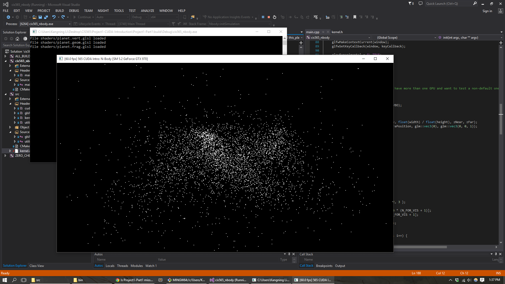
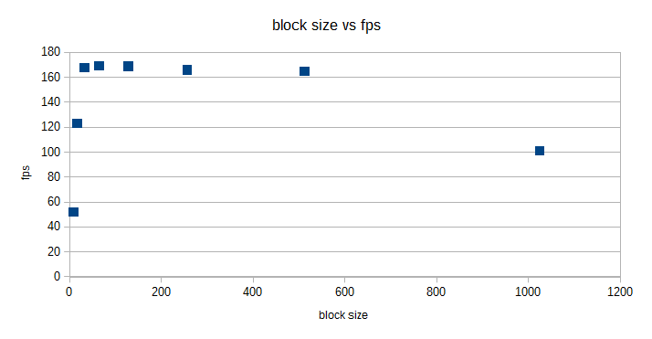

CUDA Introduction
=================

**University of Pennsylvania, CIS 565: GPU Programming and Architecture, Project 1**

* Kangning Li
* Tested on: Windows 10, i7-4790 @ 3.6GHz 16GB, GTX 970 4096MB (Personal)

This repository contains HW1 for CIS 565 2015, a CUDA nbody simulation and a basic 5x5 matrix adder, subtractor, and multiplier implemented as an introduction to CUDA.

## Questions

1. Parts 1 & 2: How does changing the tile and block sizes affect performance? Why?

|Block Size | FPS |
|-----------|-----|
|8 | 51.9 |
|16 | 123.3 |
|32 | 168 |
|64 | 169.1 |
|128 | 169 |
|256 | 166 |
|512 | 165 |
|1024 | 101 |
|2048 | N/A, crash |

For Part 1, increasing the block size improves performance (measured as fps with visualization deactivated) up to a point, after which performance decreases. My guess is that 

2. Add your performance analysis.
