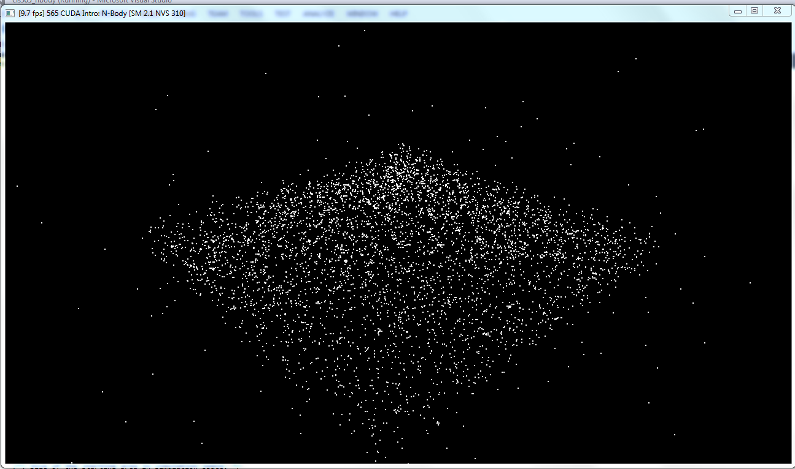
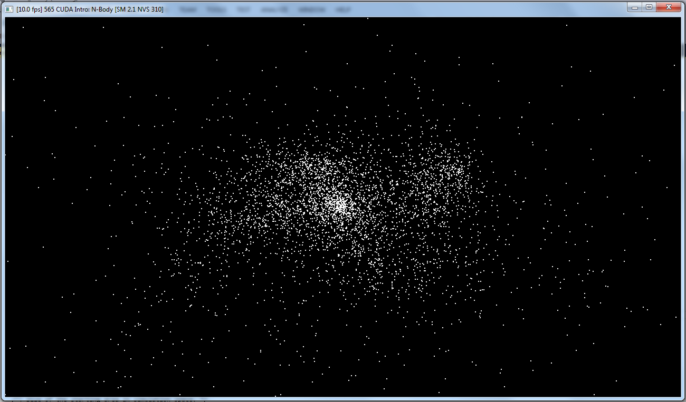
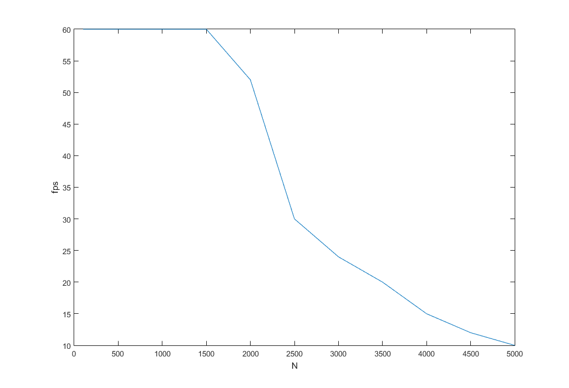
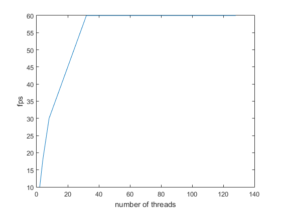

CUDA Introduction
=================

**University of Pennsylvania, CIS 565: GPU Programming and Architecture, Project 1**

* Levi Cai
* Tested on: Windows 7, i7 @ 3.4GHz 16GB, Nvidia NVS 310 (Moore 100C Lab)

Nbody:

## Performance Analysis
Number of planets vs. FPS

Number of threads vs. FPS for 1000 planets

### Questions

* Parts 1 & 2: How does changing the tile and block sizes affect performance?
  Why?
  Block size (number of threads) determines the number of threads that can share memory. As the number of threads decreases, the performance actually appears to remain constant for sometime, but at very very small numbers and requiring large number of blocks to compensate, will increase the amount of memory required for the application (since each block needs its own memory, but the threads within a block can split it). For awhile this is fine, which is why in the 2nd chart, there appears to be little effect of decreasing the number of threads up until the number is very small and you end up with many many blocks in order to compensate for the number of total threads needed to make the computations. The same trends occur in matrix multiplication.

* Part 1: How does changing the number of planets affect performance? Why?
  One thread computes the total acceleration for a single planet by iteratively summing the accelerations from all the other planets. This means that each thread operates at O(N), which is why even though there is a lot of parrelelization, it will still decrease once N is large enough. Another bottleneck that likely occurs is when too many blocks are used (if N is large, O(max number of blocks * max number of threads per block)), then a lot of memory issues occur. Thus, even though a large portion of the code is parallelized, it is still O(N), though it is better than the O(N^2) if it was all run on a single thread/CPU thread.

* Part 2: Without running comparisons of CPU code vs. GPU code, how would you
  expect the performance to compare? Why? What might be the trade-offs?
  As mentioned previously, parts of the problems that are not parallelized will give similar performance to the CPU version. In terms of the naive matrix math implementations, additions and subtractions are highly parallelizable and so should be quite fast compared to CPU solutions for somewhat large to large problems (where any memory setup tradeoff is overcome). However, for matrix multiplication, there is still coupling when iterating through the rows and columns to get the dot products. This will mean that the runtime will scale linearly with the width of the matrices. The GPU version also has a limitation based on the number of total possible threads in the current implementation since it assumes all dot products must be computed in parallel. In general then, the GPU version should be at least O(N) faster as long as the size of the matrix is constrained. In too large of problems, the need to swap memory constantly, syncronizing, etc...(at least in a naive manner), may cause the performance to be similar to that of a CPU in the multiplication case. 

**NOTE: Nsight performance analysis tools *cannot* presently be used on the lab
computers, as they require administrative access.** If you do not have access
to a CUDA-capable computer, the lab computers still allow you to do timing
mesasurements! However, the tools are very useful for performance debugging.

## Submit

If you have modified any of the `CMakeLists.txt` files at all (aside from the
list of `SOURCE_FILES`), you must test that your project can build in Moore
100B/C. Beware of any build issues discussed on the Google Group.

1. Open a GitHub pull request so that we can see that you have finished.
   The title should be "Submission: YOUR NAME".
2. Send an email to the TA (gmail: kainino1+cis565@) with:
   * **Subject**: in the form of `[CIS565] Project 0: PENNKEY`
   * Direct link to your pull request on GitHub
   * In the form of a grade (0-100+), evaluate your own performance on the
     project.
   * Feedback on the project itself, if any.

And you're done!
