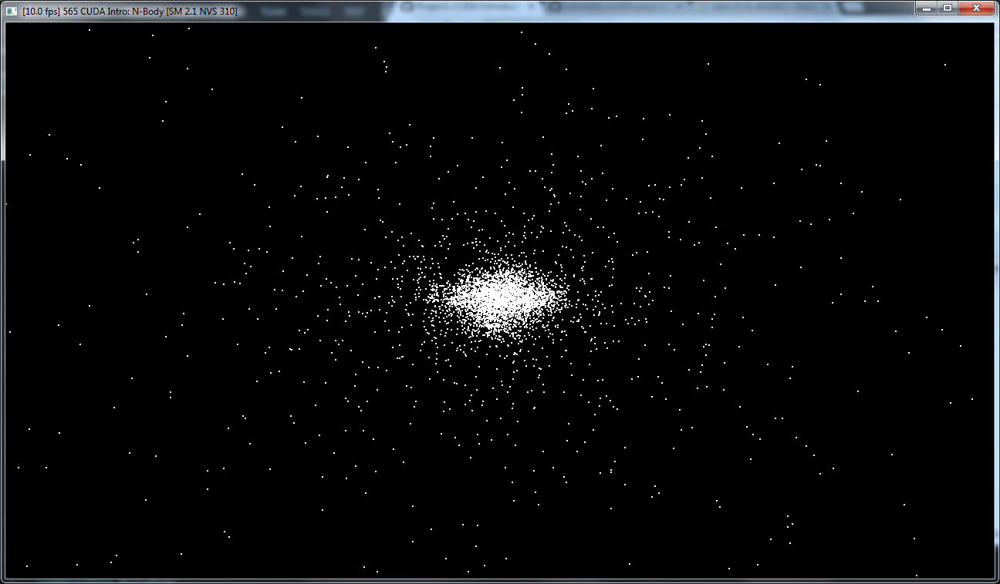

CUDA Introduction
=================

**University of Pennsylvania, CIS 565: GPU Programming and Architecture, Project 1**

* Megan Moore
* Tested on: Windows 7, i7-4770 @ 3.40GHz 16GB (Moore 100 Lab C)

### Questions

* Parts 1 & 2: How does changing the tile and block sizes affect performance?
  Why?
  Changing the block sizes can help to increase the performance of the simulation.  However, just increasing the block size will not insure that the performance increases.  The block size should be a power of 2.  This will allow the simulation to use the block memory to its fullest.  If you use a block size that is not a power of 2, some of the memory in each grid will go unused.  Thus, the block sizes that will best improve the performance of the simulation are powers of 2!

* Part 1: How does changing the number of planets affect performance? Why?

  As the number of planets increases, the performance speed decreases.  Up until about 2000 planets, the suimulation is able to run at the highest possible fps.  However, the performance quickly drops once more planets are added.  At 2100 planets, it can only run at 45 fps, and 30 fps at 2200 planets.  When there are 5000 planets in the simulation, the fps is 15.  
  
  average computation time per frame in milliseconds
  14.4 - 2000 planets
  31.3 - 3000 planets
  55.5 - 4000 planets
  86.1 - 5000 planets
  
  Each frame requires N^2 calculations.  Thus, as N increases, more time will be needed for each frame update, and shows why the computation time per frame increases as the planets increase.  This is why the performance will decrease when the number of planets is increased.  
  
* Part 2: Without running comparisons of CPU code vs. GPU code, how would you
  expect the performance to compare? Why? What might be the trade-offs?

  I would not expect the GPU code to add too much to the performance of matrix addition or subtraction.  This is because there is a minimal amount of computation done in each thread.  Thus, the speed up in time for computation will not make up for the extra time it takes to transfer the memory from the CPU to the GPU.  However, the GPU will increase the performance of the matrix multiplication.  This is because, in each thread, we are doing more computation - (in an NxN matrix) We are doing N multiplications and N-1 additions.  Using threads for this computation does allow for a speed up in performance, since the speed up in computation makes up for the loss of time from memory transfers.  
