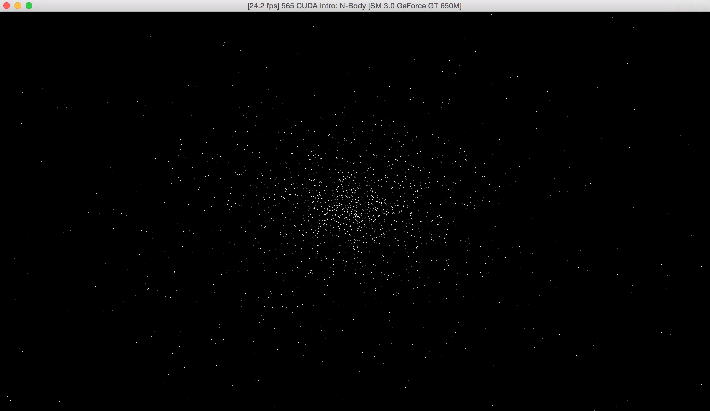
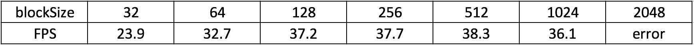
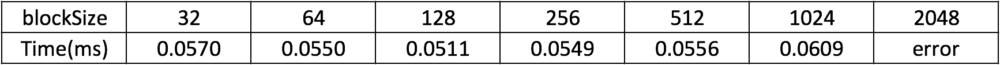
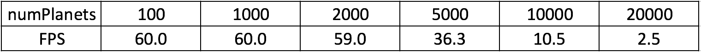

CUDA Introduction
=================

**University of Pennsylvania, CIS 565: GPU Programming and Architecture, Project 1**

* Guan Sun
* Tested on: Mac OS X Yosemite 10.10.5, Intel Core i7 @ 2.3GHz 8GB, GeForce GT 650M 1024MB (Personal Laptop)

**Part 1: N-body Simulation**

**Part 3: Performance Analysis**
* Parts 1 & 2: How does changing the tile and block sizes affect performance?
  Why?

For Part 1, the FPS performance of different block sizes is shown in the following figure. The performance remains the same as long as the block size if bigger than 128. Otherwise, the FPS will decrease as the block size becomes small. The reason for this should be that the number of blocks could run parrallel at the same tims is limited. Too small block size will increase the number of blocks thus meet the limit.
  

For Part 2, the average time (over 1000 times computation) of add, sub and mul of different block sizes is shown in the following figure. The performance do not  change with the block size. The reason for this should be that the matrices we are commputing are too small (only 25 elements). All the computation can alway be done concurrently. So the computation time is constant.
  

* Part 1: How does changing the number of planets affect performance? Why?

The FPS performance of different number of planets is shown in the following figure. When the number of planets is less than 2000, the FPS could almost alway reach 60. However, as the number increases to more than 2000, the FPS decreases quickly. The reason for this is that more planets to simulate means more threads and more computation, the processing power of the GPU will limit the FPS.
  

* Part 2: Without running comparisons of CPU code vs. GPU code, how would you
  expect the performance to compare? Why? What might be the trade-offs?

For these samll matrices computation, the CPU might be faster. The CPU running this is number of elements * computation time for one element, while the GPU running time is the CUDA memory copy time and the compution time for one element. In our case, the number of elements is only 25, it is possible that the CUDA memory copy time is even longer than compute each element one by one. 