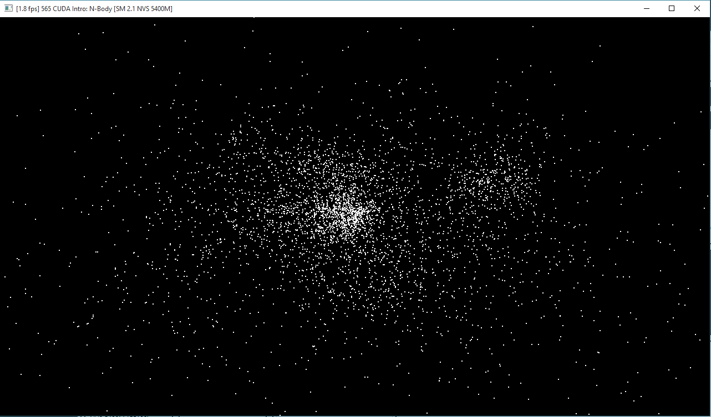

CUDA Introduction
=================

**University of Pennsylvania, CIS 565: GPU Programming and Architecture, Project 1**

* Tongbo Sui
* Tested on: Windows 10, i5-3320M @ 2.60GHz 8GB, NVS 5400M 2GB (Personal)

## Screenshots

### Part 1

## Performance Analysis
#### Parts 1 & 2: How does changing the tile and block sizes affect performance? Why?
* Part 1:
* Part 2:
* 
#### How does changing the number of planets affect performance? Why?
Varying the number of planets can significantly impact the performace in terms of frame rate. With block size of 128, and grid size automatically calculated based on number of planets, 5000 planets yields 22 fps, while 500 planet, which is 1/10 of the original size, yields 300 fps. Further reducing planet population to 50 yields a fps of 400.

With 5000 planets, there are 40 blocks for this kernel call. Meanwhile each thread needs to run a for-loop for 5000 steps. The for-loop could be time-consuming since at each step there are a lot of shared memory access. For 5000+ threads this can make a bottleneck for the performance. Besides, NVS 5400 is a pretty old card, and might not support 40 blocks in parallel. Therefore the scheduling involves postponing and switching between blocks, which can cause a significant overhead.

Reducing workload immediately yields a big improvement in performance. However the improvement diminishes as planet population shrinks. With 50 planets, the population can fit into one block. Therefore its performance is bounded by the best performance of a single block.

#### Without running comparisons of CPU code vs. GPU code, how would you expect the performance to compare? Why? What might be the trade-offs?
I expect GPU code to run much faster in term of execution time. CPU code would need a sequential nested loop that cannot be carried out very well in parallel. This nested loop would have an complexity of n^3, for a square n by n matrix. Meanwhile GPU code can utilize the parallelism, where each thread runs in O(n). If we consider the scheduling overhead to be neglegible, then GPU code will be significantly faster due to this complexity difference.

CPU may have a faster memory access, and GPU doesn't. Therefore the actual performance difference might not be that significant, due to overhead caused by excessive memory access from GPU code. Therefore the trade-off will be that to sacrifice I/O time for faster arithmetic operations.

## Submit

If you have modified any of the `CMakeLists.txt` files at all (aside from the
list of `SOURCE_FILES`), you must test that your project can build in Moore
100B/C. Beware of any build issues discussed on the Google Group.

1. Open a GitHub pull request so that we can see that you have finished.
   The title should be "Submission: YOUR NAME".
2. Send an email to the TA (gmail: kainino1+cis565@) with:
   * **Subject**: in the form of `[CIS565] Project 0: PENNKEY`
   * Direct link to your pull request on GitHub
   * In the form of a grade (0-100+), evaluate your own performance on the
     project.
   * Feedback on the project itself, if any.

And you're done!
