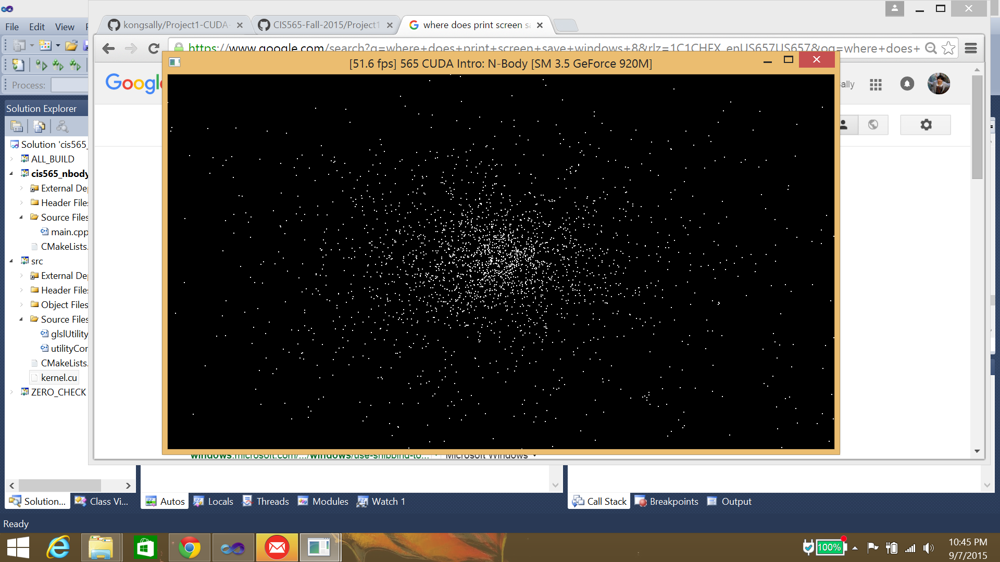

CUDA Introduction
=================

**University of Pennsylvania, CIS 565: GPU Programming and Architecture, Project 1**

* Sally Kong
* Tested on: Windos 8, i7-5500U CPU @ 2.40GHz 2.40 GHz, GEForce 920M (Personal)

## Part 1: N-body Simulation

## Part 2: Matrix Math

## Part 3: Performance Analysis

### Questions

* Parts 1 & 2: How does changing the tile and block sizes affect performance?
  Why?
* Part 1: How does changing the number of planets affect performance? Why?

Having more planets lowers the fps because there are more computations to be done for every planet for every additional planet. Below are the observed fps for simulations with different numbers of planets and with/without the visualization.

With Visualization:  
N = 5,000 -> ~50fps  
N = 10,000 -> ~14fps  
N = 20,000 -> ~4.2fps  
N = 50,000 -> ~0.7fps  

Without Visualization:  
N = 5,000 -> ~60fps  
N = 10,000 -> ~15fps  
N = 20,000 -> ~4.2fps  
N = 50,000 -> ~0.7fps  

* Part 2: Without running comparisons of CPU code vs. GPU code, how would you
  expect the performance to compare? Why? What might be the trade-offs?
I would expect the performance in the GPU to be faster because GPUs are optimized for parallel computations.
