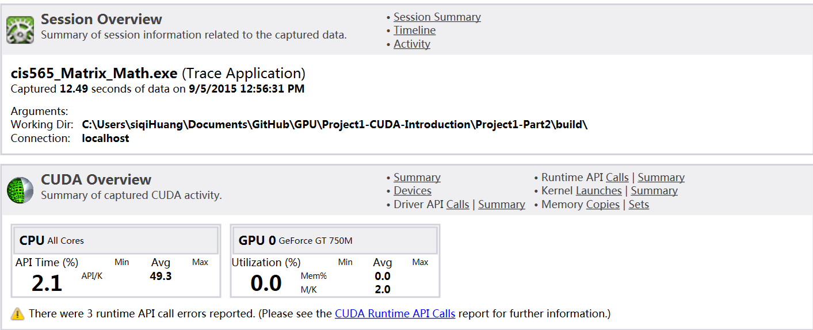
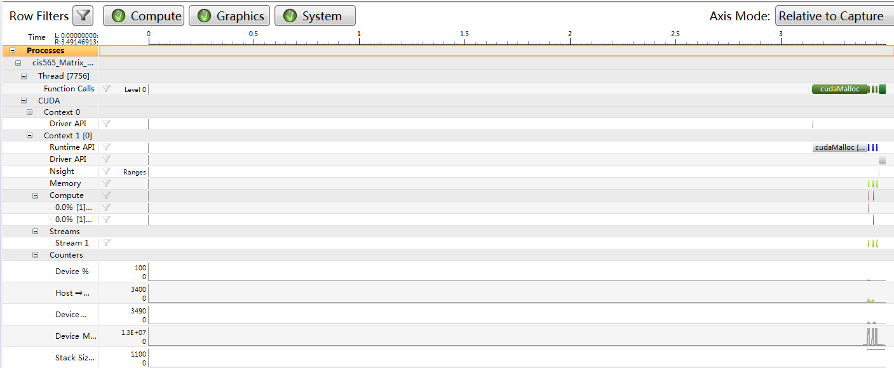

CUDA Introduction
=================

**University of Pennsylvania, CIS 565: GPU Programming and Architecture, Project 1**

siqi Huang
Tested on: Windows 7, Inter(R) Core(TM) i7-4870 HQ CPU@ 2.5GHz; GeForce GT 750M(GK107) (Personal Computer)

PART I:
The N body simulation is done and the following five images is in the situation where N=5000;

I have also done the simulation when N=1000 and compare their performance:
The performance of N=1000:

The performance of N=5000:

The fps of N=1000 is 60, and 40 when N=5000. Although we have enough thread in GPU to assign the task, their difference comes from the pairwise computation when calculating the acceleration. In N=5000, each thread in GPU has 4000 more computation than in N=1000.
The block size change is done in part2.

PART II:
The matrix simulation is done and the following is the comparsion when the matrix size is 1000 and 20.
When matrix size is 20:

When matrix size is 1000:

From the time elapsed, there is basically no difference because there are enough thread to do the task we want.
In the actual code, the compute order is add, sub and mul. The first input is the matrix size, the second is the block size and the last one is value indicating whether to show the result. In the mul operation, the block size if the same as the matrix size no matter what the input is because it is not easy to convert the index of row and col to the right one. If the block size times the block size is larger the the thread Num in a GPU block(512 in mine), you will get all 0.
If this is done on the CPU, when the number of input is small, it is much faster than on GPU becase most of time in the GPU version is on the memory copy. But when input size is big, GPU version is much faster than CPU because computing any number of data is almost the same to GPU if it is within the limit.
