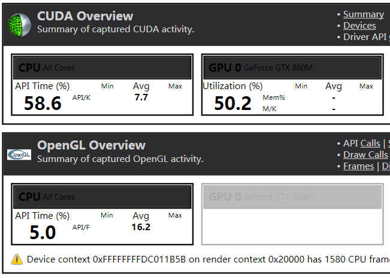

Zhimin Zhao

ASUS-NotebookSKU G551JM

personal laptop

##**Screenshots**

##**Parts 1 & 2: How does changing the tile and block sizes affect performance? Why?**

To alter block sizes (shown below) affects fps performance, however, the impact in this project is almost negligible. I think the performance should increase to a peak and then goes down as the block size raises, since at the first stage the larger block size the higher occupancy, which is the ratio of the number of active warps per multiprocessor to the maximum number of warps that can be active on the multiprocessor at once. Although higher occupancy does not always mean higher performance, but it is a useful metric for gauging the latency hiding ability of a kernel. Well, as the size of block continue growing, developers might find 66% is enough to saturate the bandwidth and the performance gradually ceases to advance. 

Attached is my part-1 test result:

5000 planets, 32-1024 threads per block: 72.9 ~ 73.8 fps

500000 planets, 1024 threads per block: Nvadia driver crashed

Changing tile sizes does have a minor impact on the performance, in light of execution time. For matrix addition and subtraction, smaller block size runs faster, while there is negligible difference for multiplication.

Attached is my part-2 test result:

(1, 1) Block, (6, 6) Thread: Add -- 0.007168, Sub -- 0.007136, Mul -- 0.008192

(1, 3) Block, (2, 6) Thread: Add -- 0.008192, Sub -- 0.007168, Mul -- 0.008192

(1, 6) Block, (6, 1) Thread: Add -- 0.007200, Sub -- 0.007168, Mul -- 0.007168

(3, 6) Block, (2, 1) Thread: Add -- 0.008192, Sub -- 0.008160, Mul -- 0.008192

(6, 6) Block, (1, 1) Thread: Add -- 0.008192, Sub -- 0.008224, Mul -- 0.008192

##**Part 1: How does changing the number of planets affect performance? Why?**

The overall performance should rest on the best performance of a single block.Reducing workload immediately yields a big improvement in performance, however the improvement diminishes as planet population shrinks.

##**Part 2: Without running comparisons of CPU code vs. GPU code, how would you expect the performance to compare? Why? What might be the trade-offs?**

I expect that GPU code runs even faster as far as execution time is concerned. Just as Coach Cozzi had mentioned, CPU code tend to execute sequential nested loops that cannot be carried out quite well in parallel. E.g. the multiplication of two square matrix written in CPU code would have an algorithm complexity up to n^3. Meanwhile GPU code can take good advantage of the parallel algorithm, where each thread runs in O(n). If we consider the scheduling overhead to be neglegible, then GPU code will be considerably faster thanks to algorithm complexity difference.

In terms of architecture, CPU might have less memory access, while GPU doesn't.Probably that's why the matrix multiplication computed in parallel is not much faster than traditional sequential algorithm, if the matrices are not that large.Therefore the trade-off will be the exchange of excessive I/O time with faster arithmetic operations.
